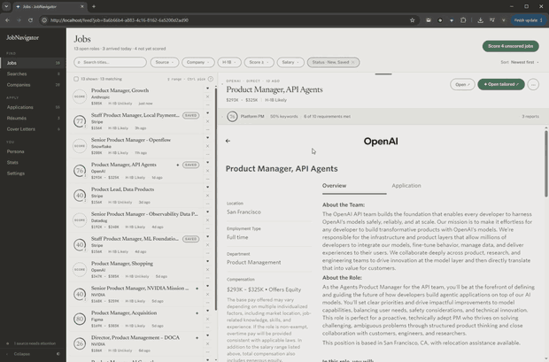
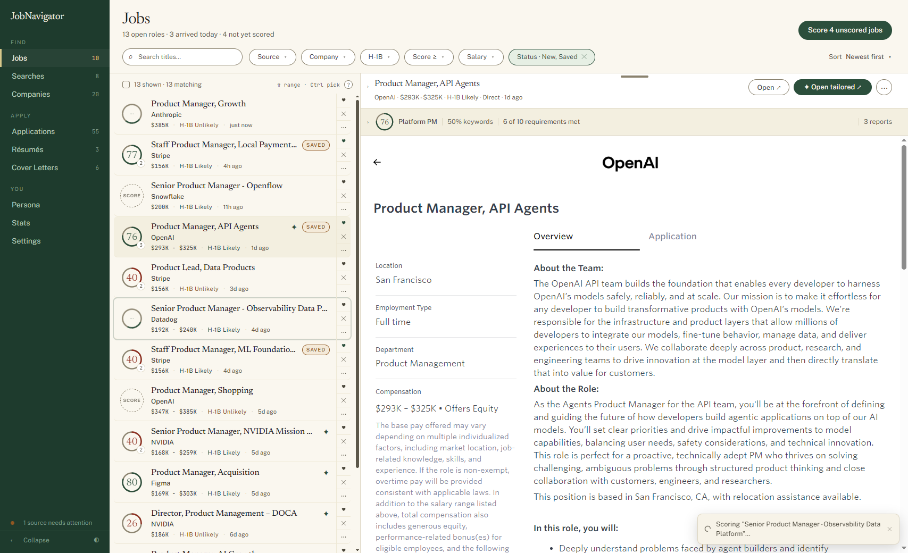
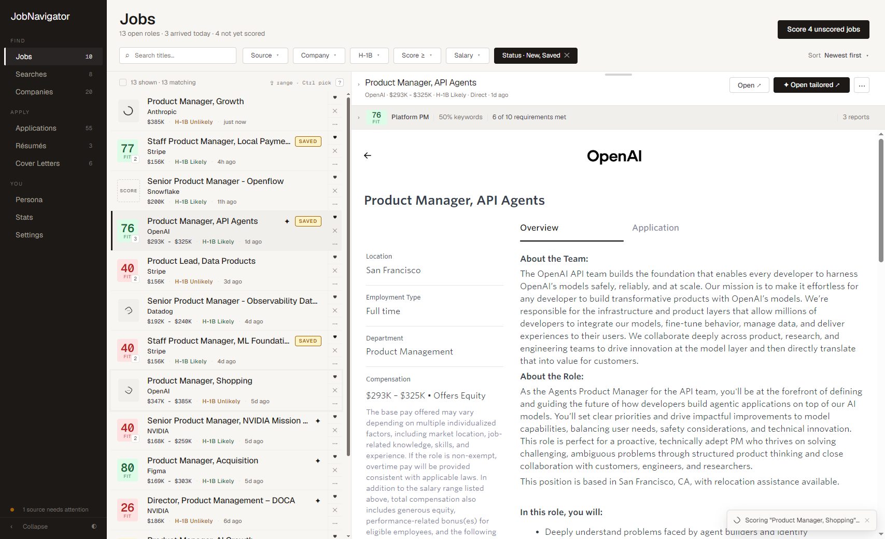
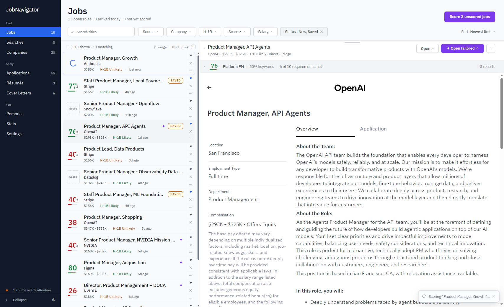
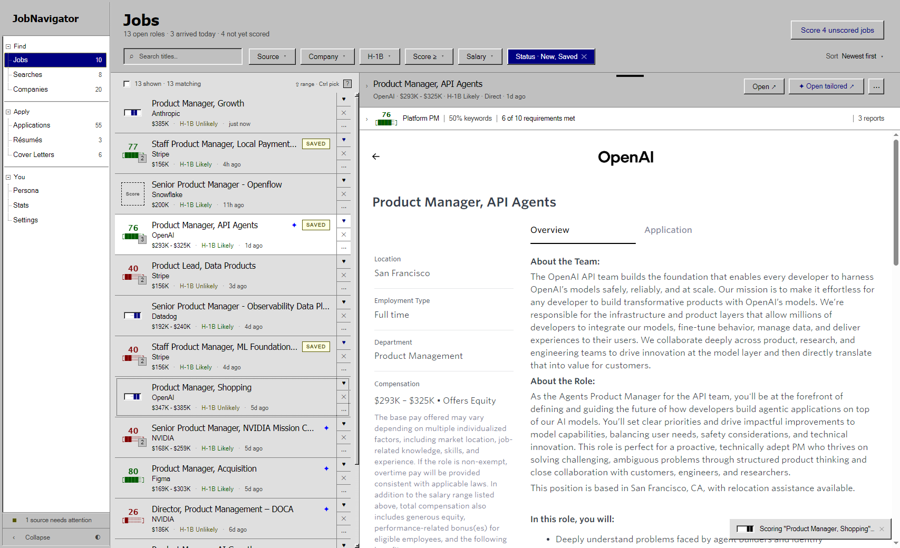

# JobNavigator

Self-hosted job-hunt automation.
Scrape career pages and aggregators, score jobs against your résumés with an LLM, tailor résumés and cover letters, auto-fill applications from your persona, get Telegram alerts, track every application.

<p align="center">
  
</p>

<p align="center">
  <a href="docs/board.png"></a>
  <a href="docs/slate.png"></a>
  <a href="docs/v1like.png"></a>
  <a href="docs/win98.png"></a>
  <br>
  <sub>Five themes, each in light and dark: Paper (above), Green Paper, Stone, V1 Style, Windows 98.</sub>
</p>

## How It Works

```
┌─────────────────────────────────────────────────────────────────────────────┐
│                               JOB DISCOVERY                                 │
│                                                                             │
│   Career Pages          │  Aggregators            │  Chrome Extension       │
│                         │                         │                         │
│   Any site via          │  JobSpy: LinkedIn,      │  Passive LinkedIn       │
│   Playwright            │  Indeed, ZipRecruiter,  │  capture while          │
│                         │  Google Jobs            │  browsing               │
│   11 ATS endpoints:     │                         │                         │
│   Workday, Greenhouse   │  LinkedIn Personal      │  Auto-fill based on     │
│   Lever, Ashby,         │  collections            │  your persona input     │
│   Oracle, Phenom,       │                         │  and question bank      │
│   TalentBrew, Rippling  │  Jobright.ai            │                         │
│   SmartRecruiters,      │  Levels.fyi             │  Save any job from      │
│   + custom              │  freehire.me            │  any page               │
│                         │                         │                         │
└─────────────────────────┴───────────┬─────────────┴─────────────────────────┘
                                      │
                                      ▼
┌─────────────────────────────────────────────────────────────────────────────┐
│                                PROCESSING                                   │
│                                                                             │
│   Dedup ────── URL-hash dedup, tracking params stripped                     │
│   Filters ──── Title / company include & exclude, body exclusion phrases    │
│   H-1B ─────── Company LCA data from MyVisaJobs (cached)                    │
│   Salary ───── Extracted from posting, H-1B data, description               │
│                                                                             │
└─────────────────────────────────────┬───────────────────────────────────────┘
                                      │
                                      ▼
┌─────────────────────────────────────────────────────────────────────────────┐
│                                 JOB FEED                                    │
│                                                                             │
│   Review ───── Dynamic filters, sorting, detail panel                       │
│   Decide ───── Save promising jobs, skip the rest, score with AI            │
│                                                                             │
└─────────────────────────────────────┬───────────────────────────────────────┘
                                      │
                                      ▼
┌─────────────────────────────────────────────────────────────────────────────┐
│                              AI RESUME SCORING                              │
│                                                                             │
│   Providers ── Claude API, Claude CLI, OpenAI, OpenRouter, Ollama           │
│   Depths ───── Light (scores only) or Full (report + keyword analysis)      │
│   Multi ────── Score against multiple resumes, compare fit per role         │
│                                                                             │
└─────────────────────────────────────┬───────────────────────────────────────┘
                                      │
                                      ▼
┌─────────────────────────────────────────────────────────────────────────────┐
│                           RESUME + COVER LETTER                             │
│                                                                             │
│   Templates ── 8 resume + 8 cover-letter, auto-discovered (add your own!)   │
│   AI Tailor ── Rewrites resume bullets/keywords from the scoring report     │
│   AI Letter ── Job-specific cover letters from resume + JD, voice presets   │
│   Export ───── Live-preview PDF via Playwright with export                  │
│                                                                             │
└─────────────────────────────────────┬───────────────────────────────────────┘
                                      │
                                      ▼
┌─────────────────────────────────────────────────────────────────────────────┐
│                                   TRACK                                     │
│                                                                             │
│   Autofill ─── ATS forms + AI answers to free-text questions (Persona)       │
│   Applications  Stages, interviews, notes, prep handover, funnel and Sankey │
│   Tracer ───── Unique links per resume/letter, tracks who opened them       │
│   Gmail ────── Auto-detects responses, updates application status           │
│   Telegram ─── Job alerts, daily digest, scrape health notifications        │
│                                                                             │
└─────────────────────────────────────────────────────────────────────────────┘
```

## Features

| Feature | Description |
|---------|-------------|
| **Discovery** | Career pages (Playwright + 11 ATS handlers), JobSpy (LinkedIn, Indeed, ZipRecruiter, Google), LinkedIn collections, Levels.fyi, Jobright.ai, freehire.me, the Chrome extension |
| **Scoring** | Claude, OpenAI, OpenRouter, Ollama or Claude Code; live model search, a model per feature; Light (score) or Full (report, keyword coverage, requirement mapping) against every base résumé; prompt caching on Anthropic |
| **Résumés** | Structured base résumés, tailoring per job with a review step, 8 PDF templates (drop in your own), tracked links that record opens |
| **Cover letters** | Generated from the paired résumé and persona; voice and length presets, 8 templates, PDF |
| **Dedup** | URL identity hash (tracking params stripped) plus company + title hash across sources |
| **Jobs** | Filters, sorting, keyboard shortcuts (`?`), full report, collapsible analysis pane, bulk actions with undo, posting preview |
| **Applications** | Stages, interviews, notes, status history (funnel and Sankey in Stats), a prep handover for any AI chat |
| **Persona** | Contact, work authorization, compensation, preferences, résumé content, Q&A bank; import from a résumé or PDF |
| **Extension** | Passive LinkedIn capture, save any job from any page, ATS form autofill and AI answers to free-text questions from your Persona |
| **Gmail** | Polls replies, classifies them, updates the application |
| **Telegram** | New-job alerts, daily digest, scrape health, inline actions |
| **H-1B** | Company filing lookups, description exclusion phrases |
| **Scheduling** | Intervals and crons for scraping, email, backups, cleanup, auto-reject; every cron field explains itself and offers presets |
| **Themes** | Paper, Green Paper, Stone, V1 Style, Windows 98 × light / dark / system |

> The posting preview is an `iframe`; sites that refuse framing show blank unless the extension (which strips the frame-blocking headers) is installed. "Open" always works, and applied jobs keep a cached snapshot.

## Quick Start

```bash
git clone https://github.com/vesaias/JobNavigator.git
cd JobNavigator
cp .env.example .env

docker compose up --build -d
```

Open `http://localhost`. On first run sign in with a blank key, then set one in Settings › Advanced. The previous interface is at `/classic`.

**First steps:**
1. Settings › AI — provider and key
2. Résumés — create a base résumé or import a PDF
3. Persona — import from that résumé, fill the Q&A bank
4. Companies and Searches — add a few, run them

## Chrome Extension ("The Navigator")

- Unblocks the posting preview by stripping frame-blocking headers.
- Captures job ids while you browse `linkedin.com/jobs/collections/*` and imports them with full details.
- Fills ATS forms and drafts answers to free-text questions from your Persona and Q&A bank (toggle in the popup; model and prompt in Settings › AI).

Install: `chrome://extensions` › Developer mode › Load unpacked › `extension/`. The LinkedIn import needs a separate LinkedIn account in Settings › Accounts.

## Optional Integrations

**Telegram** — bot token in `.env`, chat id in Settings.

**Gmail** — `python backend/gmail_oauth_setup.py`, OAuth credentials in `.env`.

## Tech Stack

| Layer | Technology |
|-------|-----------|
| Backend | Python 3.12, FastAPI, SQLAlchemy, APScheduler, Playwright |
| Frontend | React 18, Vite, Recharts, a token-based design system ([DESIGN-SYSTEM.md](frontend/src/DESIGN-SYSTEM.md)) |
| Database | PostgreSQL 16 |
| Infrastructure | Docker Compose, Caddy, nginx |
| AI | Anthropic SDK, OpenAI SDK, Ollama, Claude Code CLI |
| Extension | Chrome Manifest V3 |

## Contributing

PRs welcome, see [CONTRIBUTING.md](CONTRIBUTING.md). Good first ones: an ATS handler, a résumé template, a theme.

## Backups

Scheduled `pg_dump`s land in `backups/` (five kept). They contain the settings table, API keys included: treat them like `.env`. The folder is git-ignored.

## Security

Found a vulnerability? See [SECURITY.md](SECURITY.md). Please don't open public issues for security bugs.

## Privacy

Self-hosted. Your résumés, jobs and credentials stay on your machine; the only outside party is the AI provider you configure.

## Disclaimer

Personal use. Not affiliated with any job platform; some scrapers are off by default and you are responsible for the terms of the sites you use. See [LEGAL_DISCLAIMER.md](LEGAL_DISCLAIMER.md).

## License

[MIT](LICENSE)
